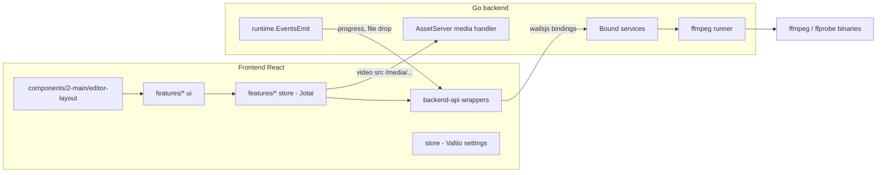

# LosslessCut-style editor on Go + Wails

## Decisions (from your answers)
- **Scope:** the full LosslessCut feature set, delivered in phases. Each phase is shippable.
- **ffmpeg:** works like the original. A build script downloads static `ffmpeg`/`ffprobe` and places them next to the exe in an `ffmpeg/` folder. The binaries are looked up in this order: the `customFfPath` setting, then `<exeDir>/ffmpeg`, then `PATH` (for dev).
- **Preview:** a Wails AssetServer handler streams local files with HTTP Range support. If WebView2 can't play the format, the app falls back to an ffmpeg-generated preview proxy, like LosslessCut's "convert to supported format" (html5ify) modes.
- **State:** Jotai for all editor and feature state: atoms, write-only action atoms, derived atoms, and `jotai-family` for per-item atoms. Valtio stays for the persisted app settings in [frontend/src/store/1-ui-settings.ts](frontend/src/store/1-ui-settings.ts).
- **Template:** keep the welcome page, theme, options, confirmation dialog, toaster and icons. Remove `2-main/xyz-demos` and the login dialog.
- **License:** this repo is GPL-2.0-only, the same as LosslessCut, so porting its logic is license-compatible.

## Architecture

## Backend structure (Go)
Each service is its own bound struct, so Wails generates a separate `wailsjs/go/<pkg>/<Struct>` for each one. A new feature means adding a package and registering it in `Bind`.

- [main.go](main.go): add `AssetServer: &assetserver.Options{Assets, Handler: media.Handler}`, `DragAndDrop{EnableFileDrop: true}`, and bind the services. Rename the app and module from `tm-template-go-26` to `video-ed-26` (this also touches [wails.json](wails.json), [go.mod](go.mod), the config dir in [backend/options.go](backend/options.go), and `STORE_KEY`).
- `backend/` (existing): `App` lifecycle, window options, devtools. Unchanged.
- `backend/ffbin/`: locates the binaries (custom path, exe dir, PATH) and reports their versions.
- `backend/ffrun/`: a generic ffmpeg runner with `context` cancel, `-progress pipe:1` parsing, and progress emitted as events with a job id.
- `backend/probe/`: runs `ffprobe -show_format -show_streams -show_chapters -of json` and returns typed structs.
- `backend/media/`: the HTTP handler for `/media/?id=`. It only serves files registered through `OpenFile`, using `http.ServeContent` (which handles Range requests).
- `backend/preview/`: html5ify proxy modes (fastest remux, fast-audio, slow transcode) written to a temp dir, with progress reporting.
- `backend/keyframes/`: reads keyframe timestamps for a time window (`-skip_frame nokey`).
- `backend/thumbs/` and `backend/waveform/`: timeline thumbnails and waveform images, served through the media handler.
- `backend/export/`: builds and runs the cut commands. Covers keyframe vs. accurate cut, per-segment `-ss/-to`, `-map` from the selected tracks, `-avoid_negative_ts`, metadata and chapter preservation, concat merge, and the output filename template.
- `backend/project/`: loads and saves the `.llc`-style project JSON next to the media file (autosave).
- `backend/dialogs/`: open and save file dialogs, plus reveal-in-explorer.

## Frontend structure
The new code goes in `frontend/src/features/`. Each feature folder follows the same internal layout: `0-store/` (Jotai atoms), `1-ui/` (components), and `9-types.ts`. Layouts only compose features and hold no state, so a new layout replaces one folder.

- `frontend/src/backend-api/`: typed wrappers over `wailsjs` calls, plus an event bridge that forwards Wails events into atoms.
- `features/1-media-file/`: open, drop and close a file, and hold the probe info. `openFileAtom` is an action atom.
- `features/2-player/`: `<video>` binding, play/pause, seek, frame step, rate, volume, and preview-proxy fallback.
- `features/3-timeline/`: zoom and scroll, playhead, segment bars, keyframe markers, thumbnails, waveform.
- `features/4-segments/`: the segment list, selection, add/split/delete/reorder/invert/rename, plus undo and redo.
- `features/5-tracks/`: the stream table, with include/exclude per stream and track metadata.
- `features/6-export/`: the export dialog, options, and progress/cancel.
- `features/7-project/`: autosave and loading the `.llc` project.
- `features/8-commands/`: a command registry plus keyboard shortcuts (see the ideas below).
- `features/9-ffmpeg-status/`: shows the binary status and lets you set `customFfPath`.
- `components/2-main/editor-layout/`: layout v1, which mimics LosslessCut. It has a top bar, player with the segments side panel, timeline, and a bottom controls bar, built with `ResizablePanelGroup` and shadcn components.
- [frontend/src/store/1-ui-settings.ts](frontend/src/store/1-ui-settings.ts) (Valtio): new editor settings such as `customFfPath`, export defaults, keyboard map, autosave on/off, and panel sizes.

## State patterns (to minimize `useEffect` and `useCallback`)
- All mutations are write-only action atoms, for example `addSegmentAtCursorAtom`, `splitSegmentAtom`, and `exportAtom`. Components call them with `useSetAtom`. This follows the approach already in `assets/docs/...jotai_set_atom_vs_use.md`.
- Derived atoms provide computed values: `selectedSegmentsAtom`, `exportableSegmentsAtom`, `timelineViewportAtom`, `outputNamesAtom`.
- `jotai-family` provides per-segment atoms (`segmentAtomFamily(id)`), so editing one segment doesn't re-render the whole list.
- Video binding uses a React 19 ref callback with a cleanup function, so no `useEffect` is needed. It calls `bindVideoElementAtom`, which attaches media event listeners that write `currentTimeAtom`, `durationAtom` and `playingAtom`. The playhead updates through `requestVideoFrameCallback`.
- Backend events are subscribed once at the module level in `backend-api/events.ts` and forwarded with `getDefaultStore().set`, not in component effects.
- `jotai-effect` (already installed) handles the few reactive side effects, such as autosave, debounced keyframe loading for the visible window, and thumbnail requests.

## Ideas for you to consider
- **Command registry.** Every action is a command `{ id, title, atom, defaultKeys }`. Toolbar buttons, the keyboard map, a shadcn `Command` palette (Ctrl+K), and context menus all trigger the same atoms. Shortcuts can be remapped in Options, like LosslessCut's keyboard dialog.
- **Job manager.** Use one `jobsAtom`, keyed by job id, for all long ffmpeg tasks: export, html5ify, thumbnails and detection. It would come with a small jobs popover in the footer.
- **Pluggable layouts.** Add a `layoutId` setting so the LosslessCut-like layout and a future custom layout can coexist.
- **Batch/file list.** Make the file list a Jotai collection from the start, even with one file at first, so batch mode later doesn't need a refactor.

## Phases
1. **Foundation:** rename the app, remove the demos and login dialog, set up the backend service skeleton, the ffmpeg locator and download script, the media handler, the `backend-api` layer, and the empty editor layout.
2. **Open and play:** open via dialog or drag-drop, run ffprobe, play through the media handler, add the html5ify fallback, and add the player controls.
3. **Timeline and segments:** timeline zoom and scroll, segments CRUD, undo and redo, the segments side panel, and the command registry with shortcuts.
4. **Export:** the lossless cut of segments to separate or merged files, with options, the filename template, progress and cancel, plus project autosave.
5. **Tracks and precision:** the tracks panel with stream selection, keyframe markers and snapping, thumbnails and waveform.
6. **Extras (LosslessCut parity):** capture snapshot, detect black/silent/scene-change segments, import and export segments (CSV, EDL, CUE, YouTube chapters), extract all tracks, merge/concat files, batch file list, rotation metadata, and smart cut (experimental).