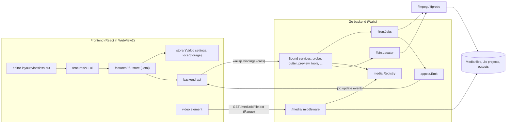
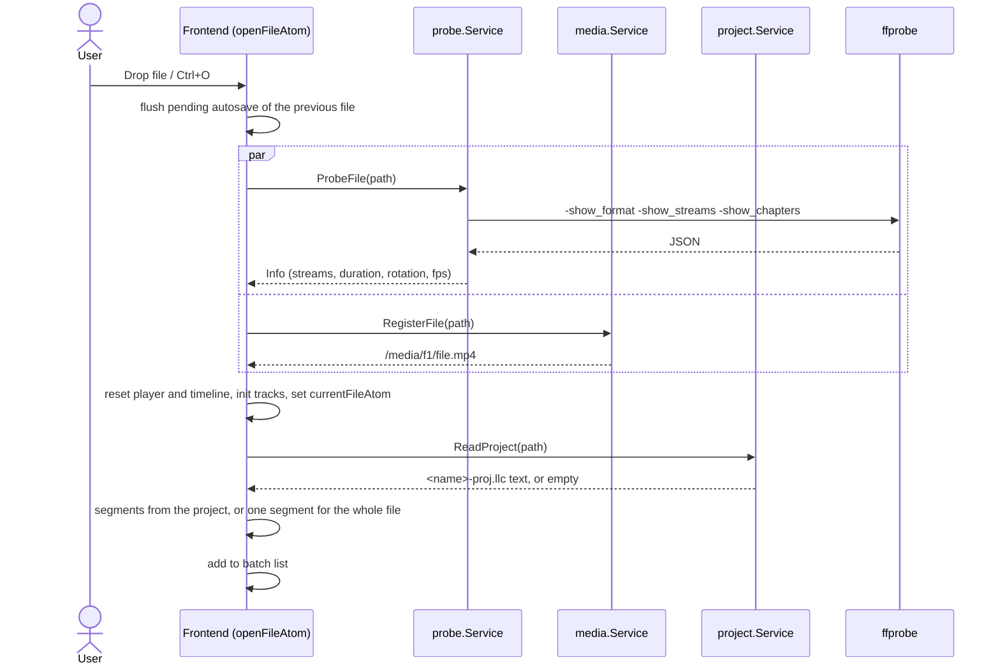
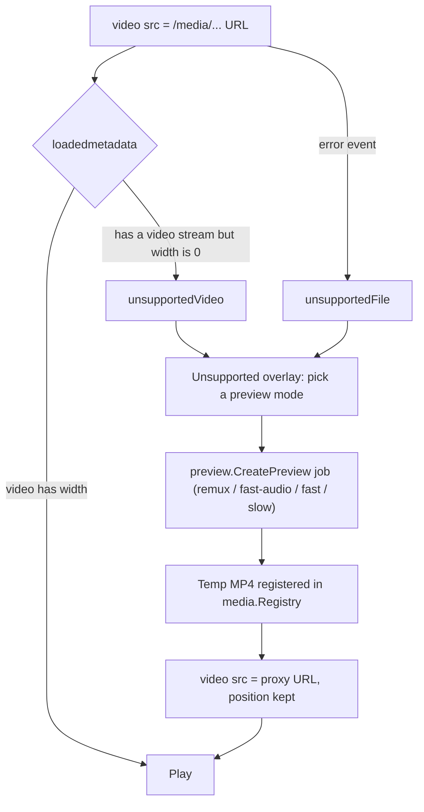
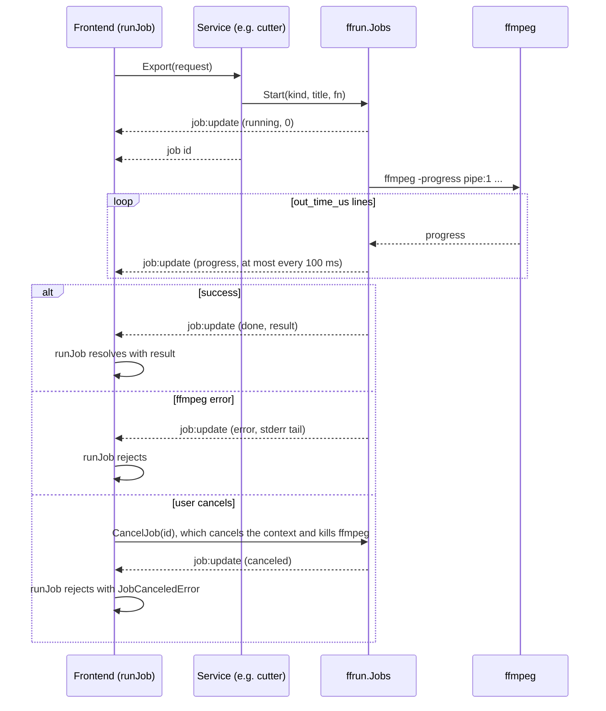
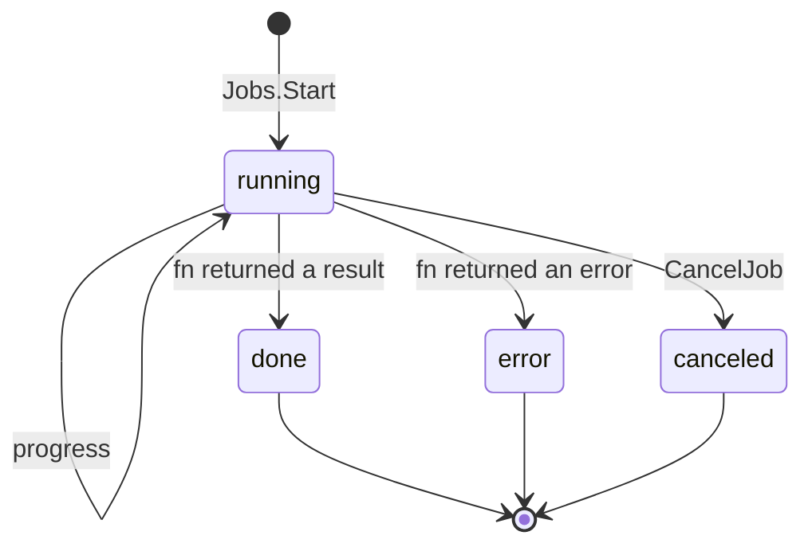
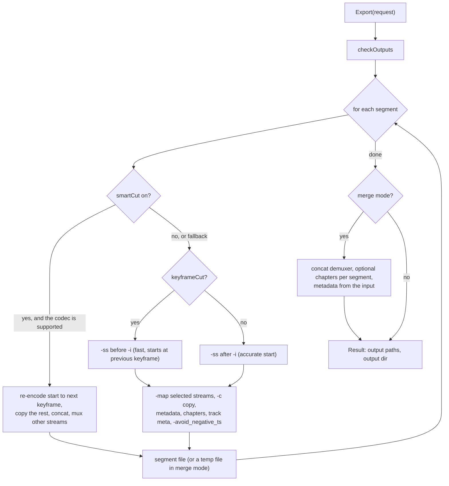
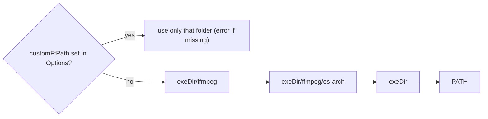

# Video Ed

A lossless video and audio cutter for the desktop, in the style of [LosslessCut](https://github.com/mifi/lossless-cut). It is built with Go + [Wails](https://wails.io) and a React frontend, and uses [FFmpeg](https://ffmpeg.org) for all media work.

## Table of contents

- [About](#about)
- [Features](#features)
- [Tech stack](#tech-stack)
- [Getting started](#getting-started)
  - [Prerequisites](#prerequisites)
  - [Install](#install)
  - [Live development](#live-development)
- [Building](#building)
  - [Build scripts](#build-scripts)
  - [Bundling ffmpeg](#bundling-ffmpeg)
  - [Build output](#build-output)
- [Project structure](#project-structure)
  - [Repository layout](#repository-layout)
  - [Backend (Go)](#backend-go)
  - [Frontend (React)](#frontend-react)
- [Architecture](#architecture)
  - [Component overview](#component-overview)
  - [Opening a file](#opening-a-file)
  - [Playback and the preview fallback](#playback-and-the-preview-fallback)
  - [Long-running jobs](#long-running-jobs)
  - [Exporting segments](#exporting-segments)
  - [Locating ffmpeg](#locating-ffmpeg)
- [Data structures](#data-structures)
  - [Segment](#segment)
  - [MediaFile and probe info](#mediafile-and-probe-info)
  - [Job](#job)
  - [Export request](#export-request)
  - [Editor settings](#editor-settings)
  - [Project file (.llc)](#project-file-llc)
  - [Command](#command)
- [State management](#state-management)
- [Files on disk](#files-on-disk)
- [Keyboard shortcuts](#keyboard-shortcuts)
- [Extending the app](#extending-the-app)
- [Testing and code checks](#testing-and-code-checks)
- [Troubleshooting](#troubleshooting)
- [License](#license)
- [Credits](#credits)

## About

Video Ed cuts and joins video and audio files without re-encoding them. It copies the original streams into new files, so a cut takes seconds and loses no quality. You mark the parts you want to keep as segments on a timeline. The app then exports each segment as its own file, or merges them into one.

The app follows LosslessCut's behavior and file formats where that makes sense. Project files (`<name>-proj.llc`) are compatible in both directions. Output name templates use the same variables, and ffmpeg is found the same way (a custom folder, then the app folder, then `PATH`). LosslessCut is an Electron app; this one runs on Wails instead. That means a Go backend with the system webview (WebView2 on Windows), a much smaller download, and lower memory use.

Windows is the main target platform. macOS build scripts are included. Linux should work through Wails and the ffmpeg download script, but it is not tested.

## Features

- **Open files** with the file dialog or by dropping them on the window. Dropping several files adds them all to the batch list.
- **Playback** of anything the webview can decode. For other formats, the app creates a playable preview proxy with ffmpeg (remux, fast audio, fast, or slow modes). The proxy is only used for preview; export always reads the original file.
- **Timeline** with zoom and scroll, a playhead, segment bars, keyframe markers, frame thumbnails, and an audio waveform.
- **Segments**: add, set start and end, split at the playhead, duplicate, remove, reorder, invert, sort, rename, and include or exclude. Segments can also be created from the file's chapters. Every change can be undone and redone.
- **Precise positioning**: step by frame, jump to the previous or next keyframe, and snap segment edges to keyframes.
- **Tracks**: include or exclude individual streams, and edit track title and language metadata.
- **Lossless export** in three modes: separate files, one merged file, or both. Options include keyframe cut or accurate cut, experimental smart cut, `-avoid_negative_ts`, keeping metadata and chapters, turning segments into chapters, `+faststart`, rotation, output format and folder, and file name templates. Progress is shown and the export can be canceled.
- **Project autosave** to `<name>-proj.llc` next to the media file. The project is loaded again when you reopen the file.
- **Segment import and export** as CSV, YouTube chapters, MPlayer EDL, CUE (import only), and LosslessCut projects.
- **Tools**: capture the current frame as JPEG or PNG, detect black scenes, silent parts, or scene changes, extract every track to its own file, and merge whole files.
- **Batch list** of opened files.
- **Commands**: one command registry drives the menu, toolbar, context menus, keyboard shortcuts, and a command palette (`Ctrl+K`). Shortcuts can be remapped.
- **Light and dark theme**, resizable panels, and a welcome page.

## Tech stack

| Area | Libraries |
| --- | --- |
| Desktop shell | Go, Wails v2, WebView2 |
| Media | ffmpeg and ffprobe (external executables) |
| UI | React 19, TypeScript, Vite, Tailwind CSS v4, shadcn/ui, Radix UI, lucide-react, Motion, sonner, cmdk |
| State | Jotai (editor state), Valtio (persisted settings), jotai-effect, jotai-family, jotai-valtio |
| Package manager | pnpm |

## Getting started

### Prerequisites

- [Go](https://go.dev/dl/) 1.22 or newer.
- [Node.js](https://nodejs.org/) 22 or newer, which is needed for `import.meta.dirname` in the scripts.
- [pnpm](https://pnpm.io/installation).
- [Wails CLI](https://wails.io/docs/gettingstarted/installation) v2.12 or newer: `go install github.com/wailsapp/wails/v2/cmd/wails@latest`.
- On Windows, the WebView2 runtime. It is preinstalled on Windows 10 and 11.
- ffmpeg and ffprobe, either on `PATH` or downloaded with `pnpm ffmpeg:download` (see [Bundling ffmpeg](#bundling-ffmpeg)).

Run `wails doctor` (or `pnpm wails:doctor`) to check your setup.

### Install

```shell
git clone <repository-url> video-ed-26
cd video-ed-26
pnpm frontend:install
pnpm ffmpeg:download   # optional when ffmpeg is already on PATH
```

### Live development

```shell
wails dev
```

`wails dev` builds the Go side, starts the Vite dev server with hot reload, and opens the app window. It also serves the app at http://localhost:34115, where you can open it in a browser and call the Go methods from devtools. Media playback through `/media/...` only works inside the app window.

When you change the signature of a bound Go method, `wails dev` regenerates the TypeScript bindings in `frontend/wailsjs/`. Outside of `wails dev`, run `wails generate module` to regenerate them.

Developer tools open with `F12` or `Ctrl+Shift+I`. Whether they were open is remembered between runs.

## Building

```shell
pnpm build
```

This runs `wails build --clean` for `windows/amd64` and then copies ffmpeg and ffprobe next to the executable. The frontend is built automatically by Wails, using the `frontend:build` command from `wails.json`.

### Build scripts

All scripts are in the root `package.json`:

| Script | What it does |
| --- | --- |
| `pnpm dev` | `wails dev` |
| `pnpm build` | Windows amd64 build, plus ffmpeg |
| `pnpm build:macos` | macOS Intel build, plus ffmpeg |
| `pnpm build:macos-arm` | macOS Apple Silicon build, plus ffmpeg |
| `pnpm build:all` | `wails build --clean` for the current platform, without ffmpeg |
| `pnpm ffmpeg:download` | Download ffmpeg and ffprobe for the current platform |
| `pnpm frontend:install` / `frontend:build` / `frontend:dev` | Run the frontend commands from the repository root |
| `pnpm go:fmt` / `go:vet` / `go:test` | Go formatting, vetting, and tests |
| `pnpm wails:doctor` | Check the Wails toolchain |

The `scripts/` folder also has shell scripts for building on each platform and for installing the Wails CLI.

To build a Windows installer, add `-nsis` to the `wails build` command. The NSIS script is in `build/windows/installer/`.

### Bundling ffmpeg

The app does not include ffmpeg in its own binary. `scripts/download-ffmpeg.mjs` downloads static release builds and copies `ffmpeg` and `ffprobe` to `build/bin/ffmpeg/`, which is the first folder the app checks next to its executable.

```shell
node scripts/download-ffmpeg.mjs [--platform windows|darwin|linux] [--force]
```

| Platform | Source |
| --- | --- |
| Windows | [gyan.dev](https://www.gyan.dev/ffmpeg/builds/) release essentials |
| macOS | [evermeet.cx](https://evermeet.cx/ffmpeg/) (Intel builds; they run on Apple Silicon through Rosetta) |
| Linux | [johnvansickle.com](https://johnvansickle.com/ffmpeg/) amd64 static |

Downloads are cached in `build/ffmpeg-cache/<platform>/`, so `wails build --clean` (which wipes `build/bin/`) does not download them again. Use `--force` to fetch a newer version.

### Build output

```text
build/bin/
├── video-ed-26.exe        # the app
└── ffmpeg/
    ├── ffmpeg.exe
    └── ffprobe.exe
```

To distribute the app, ship the whole `build/bin/` folder. Users can also point the app at another ffmpeg folder in Options.

## Project structure

### Repository layout

```text
video-ed-26/
├── main.go                 # creates the services, binds them, starts Wails
├── wails.json              # Wails project config (frontend commands, output name)
├── go.mod
├── package.json            # root scripts: build, ffmpeg download, go checks
├── backend/                # Go code, one package per service
├── build/                  # icons, platform manifests, NSIS installer; build output in build/bin
├── scripts/                # build scripts and download-ffmpeg.mjs
└── frontend/
    ├── wailsjs/            # generated TypeScript bindings for the Go services
    └── src/
        ├── main.tsx        # entry point; calls initApp() before the first render
        ├── backend-api/    # typed wrappers over wailsjs, events, path helpers
        ├── features/       # editor features, one folder each
        ├── components/     # app shell: header, main area, footer, dialogs, welcome page
        ├── store/          # Valtio settings: UI, panel sizes, editor settings
        ├── ui/             # shadcn components, local UI pieces, icons
        └── utils/          # generic helpers and hooks
```

### Backend (Go)

Each package under `backend/` that talks to the frontend has a `Service` struct. `main.go` binds every service, and Wails generates a TypeScript module for each one in `frontend/wailsjs/go/<package>/`.

| Package | Responsibility | Bound methods |
| --- | --- | --- |
| `backend` | App lifecycle, window bounds, devtools state | `ToggleDevTools`, `SetDevToolsState` |
| `appctx` | Shares the Wails runtime context with services created before startup, and emits events | — |
| `ffbin` | Finds ffmpeg and ffprobe and reports their version | `GetStatus`, `SetCustomDir` |
| `ffrun` | Runs ffmpeg and ffprobe without a console window, parses `-progress`, and tracks background jobs | `ListJobs`, `CancelJob` |
| `media` | Registry of files the webview may load, and the `/media/` HTTP middleware with Range support | `RegisterFile` |
| `probe` | `ffprobe` format, streams, and chapters as typed structs, including rotation and fps | `ProbeFile` |
| `preview` | Playable MP4 proxies for files the webview cannot decode | `CreatePreview` |
| `keyframes` | Keyframe timestamps from packet flags (no decoding) | `GetKeyframes` |
| `thumbs` | Timeline thumbnails as JPEG data URLs, four in parallel | `GetThumbnails` |
| `waveform` | Waveform of a time range as a PNG data URL | `GetWaveform` |
| `cutter` | Lossless export: separate, merge, smart cut, metadata, chapters | `Export` |
| `project` | Reads and writes `<name>-proj.llc` next to the media file | `ReadProject`, `WriteProject`, `DeleteProject`, `ProjectPath` |
| `dialogs` | Native open, save, and folder dialogs, reveal in Explorer, small text file I/O | `OpenMediaFiles`, `OpenFile`, `SaveFile`, `SelectDirectory`, `RevealInExplorer`, `OpenPath`, `ReadTextFile`, `WriteTextFile`, `FileExists` |
| `tools` | Frame capture, black, silence, and scene detection, track extraction, merging files | `CaptureFrame`, `Detect`, `ExtractTracks`, `MergeFiles` |

Methods that can take a long time (`Export`, `CreatePreview`, `Detect`, `ExtractTracks`, `MergeFiles`) start a job and return its id right away. The result arrives later through a `job:update` event (see [Long-running jobs](#long-running-jobs)).

### Frontend (React)

Editor code lives in `frontend/src/features/`. Every feature folder has the same layout:

```text
features/<n>-<name>/
├── 0-store/     # Jotai atoms: state, derived atoms, write-only action atoms
├── 1-ui/        # React components
├── 9-types.ts   # types and constants
└── index.ts     # public exports
```

| Feature | Responsibility |
| --- | --- |
| `0-session` | Opening and closing files, which coordinates every other feature; one-time app wiring (`initApp`) |
| `0-jobs` | Mirror of the backend jobs, `runJob()` helper, jobs indicator |
| `1-media-file` | The current file and its probe info; file info dialog |
| `2-player` | `<video>` binding, play and pause, seeking, frame step, rate, volume, preview proxy |
| `3-timeline` | Viewport (zoom and scroll), ruler, playhead, segment track, keyframes, thumbnails, waveform |
| `4-segments` | Segment list, active segment, actions, undo and redo history, segments panel, cut toolbar |
| `5-tracks` | Stream selection and track metadata; tracks dialog |
| `6-export` | Output name templates, export dialog, running the export |
| `7-project` | `.llc` format and debounced autosave |
| `8-commands` | Command registry, key map, keyboard handler, app menu, command palette, shortcuts dialog |
| `9-ffmpeg-status` | ffmpeg status badge and custom ffmpeg folder option |
| `a-segments-io` | Import and export of CSV, YouTube chapters, EDL, CUE, and `.llc` |
| `b-detect` | Black, silence, and scene detection dialog |
| `c-tools` | Frame capture, track extraction, merge files dialog |
| `d-batch` | Batch file list |

The rest of `src/`:

- `backend-api/` exposes all Go services as one `api` object (`api.probe.ProbeFile(...)`), the `onJobUpdate` and `onFilesDropped` event helpers, and path helpers.
- `components/2-main/editor-layouts/` contains layouts that only compose feature components and hold no state. `lossless-cut/` is the current layout: a top bar, the player with a side panel, the timeline, a bottom bar, and a status bar. The layout is chosen by the `layoutId` setting.
- `store/` holds the persisted Valtio settings: theme and UI, panel sizes, and editor settings.

## Architecture

### Component overview



The frontend talks to Go in three ways:

1. **Calls**: generated `wailsjs` functions return promises. They are used for quick work and for starting jobs.
2. **Events**: the backend emits `job:update` for every job change. The frontend subscribes once at module load, never inside components. File drops arrive the same way through Wails' `OnFileDrop`.
3. **HTTP**: the `<video>` element and thumbnails load files from `/media/<id>/file.<ext>`. Go middleware in front of the Wails asset server answers these requests. It only serves files that were registered with `RegisterFile` (the page cannot read arbitrary paths), and it uses `http.ServeContent`, so seeking works through Range requests.

### Opening a file

`openFileAtom` in `features/0-session` is the one place that knows about every feature with per-file state.



### Playback and the preview fallback



The video element is bound with a React 19 ref callback (`bindVideoElementAtom`), with no `useEffect`. It attaches media event listeners that write `currentTimeAtom`, `playingAtom`, and related atoms. While the video plays, a `requestAnimationFrame` loop keeps the playhead smooth. Preview proxies are written to `%TEMP%/video-ed-26/previews/`, and that folder is cleared on startup.

### Long-running jobs

Every slow ffmpeg task runs through `ffrun.Jobs`. The frontend wraps it in a promise with `runJob()`:

```ts
const result = await runJob<cutter.Result>(() => api.cutter.Export(request));
```





A job can finish before the frontend starts waiting for it. To handle this, the frontend keeps those early results until `runJob` asks for them. All jobs are mirrored in `jobsAtom`, which feeds the jobs indicator in the status bar.

### Exporting segments

Output file names are built in the frontend from the name templates. The backend validates them: no path separators, no duplicates, the input file is never overwritten, and existing files are only overwritten when you allow it. Then it runs the cut.



Temporary files (merge parts, concat lists, chapter metadata, smart cut pieces) are always removed when the job ends, whether it succeeds, fails, or is canceled.

### Locating ffmpeg



This matches LosslessCut. The ffmpeg badge in the status bar shows the ffmpeg version that was found, or the lookup error.

## Data structures

TypeScript types for Go structs are generated into `frontend/wailsjs/go/models.ts`. The JSON field names below are the ones used on both sides.

### Segment

`features/4-segments/9-types.ts`

```ts
type Segment = {
    id: string;
    start: number;                  // seconds
    end: number;                    // seconds, > start
    name: string;
    tags: Record<string, string>;
    selected: boolean;              // included in export
    colorIndex: number;             // index into SEGMENT_COLORS
};
```

Every change goes through `commitSegmentsAtom`, which pushes the previous array onto the undo stack (up to 200 steps). Continuous edits, such as dragging a segment edge, call `pushHistoryAtom` once at the start and then commit with `{ history: false }`, so the whole drag is a single undo step.

### MediaFile and probe info

`features/1-media-file/9-types.ts` and `backend/probe/probe.go`

```ts
type MediaFile = {
    path: string;
    name: string;       // file name with extension
    dir: string;
    ext: string;        // ".mp4"
    url: string;        // /media/<id>/file.<ext>
    info: probe.Info;
};
```

```go
type Info struct {
    Path     string    `json:"path"`
    Format   Format    `json:"format"`   // format_name, duration, size, bit_rate, tags...
    Streams  []Stream  `json:"streams"`  // codec, type, size, rates, disposition, tags...
    Chapters []Chapter `json:"chapters"`
    Duration float64   `json:"duration"` // seconds
}
```

Besides the raw ffprobe fields, `Stream` has two computed fields. `Rotation` is in clockwise degrees, taken from the display matrix or the `rotate` tag. `Fps` is taken from `avg_frame_rate`, or `r_frame_rate` as a fallback.

### Job

`backend/ffrun/jobs.go`

```go
type Job struct {
    ID       string      `json:"id"`       // "<kind>-<unix ms>-<counter>"
    Kind     string      `json:"kind"`     // export, preview, detect, extract, merge
    Title    string      `json:"title"`
    Status   string      `json:"status"`   // running, done, error, canceled
    Progress float64     `json:"progress"` // 0..1
    Error    string      `json:"error"`
    Result   interface{} `json:"result"`   // job-specific, set when done
}
```

### Export request

`backend/cutter/export.go`

```go
type Request struct {
    InputPath          string      `json:"inputPath"`
    OutputDir          string      `json:"outputDir"`        // empty: the input folder
    Segments           []Segment   `json:"segments"`         // start, end, name, outputName
    Mode               string      `json:"mode"`             // separate, merge, merge+separate
    MergedOutputName   string      `json:"mergedOutputName"`
    StreamIndexes      []int       `json:"streamIndexes"`    // empty: all streams
    KeyframeCut        bool        `json:"keyframeCut"`
    SmartCut           bool        `json:"smartCut"`
    AvoidNegativeTs    string      `json:"avoidNegativeTs"`  // make_zero, auto, make_non_negative, disabled
    PreserveMetadata   bool        `json:"preserveMetadata"`
    PreserveChapters   bool        `json:"preserveChapters"`
    SegmentsToChapters bool        `json:"segmentsToChapters"`
    MovFaststart       bool        `json:"movFaststart"`
    Rotation           int         `json:"rotation"`         // clockwise degrees; -1 keeps the original
    TrackMeta          []TrackMeta `json:"trackMeta"`        // per-stream title and language
    Overwrite          bool        `json:"overwrite"`
}
```

The default name templates and their variables match LosslessCut:

| Template | Default |
| --- | --- |
| Segments | `${FILENAME}-${CUT_FROM}-${CUT_TO}${SEG_SUFFIX}${EXT}` |
| Merged | `${FILENAME}-cut-merged-${EPOCH_MS}${EXT}` |

The available variables are `${FILENAME}`, `${EXT}`, `${CUT_FROM}`, `${CUT_TO}`, `${SEG_NUM}`, `${SEG_LABEL}`, `${SEG_SUFFIX}`, and `${EPOCH_MS}`.

### Editor settings

`store/3-editor-settings.ts` is a Valtio proxy saved to `localStorage` under `video-ed-26__editor__v1`. Components read it with `useSnapshot(editorSettings)`. Atoms read it through `editorSettingsAtom` (from `jotai-valtio`), so derived atoms update when a setting changes.

```ts
interface EditorSettings {
    customFfPath: string;                   // folder with ffmpeg and ffprobe; empty: bundled or PATH
    autosaveProject: boolean;
    keyBindings: Record<string, string[]>;  // command id -> keys, overrides the defaults
    export: ExportOptions;                  // mode, cut options, templates, output folder...
    editorLayout: Layout;                   // player | side panel sizes
    sideTab: string;
    showThumbnails: boolean;
    showWaveform: boolean;
    showKeyframes: boolean;
    snapToKeyframes: boolean;
    followPlayhead: boolean;
    timelineHeight: number;
    captureFormat: "jpg" | "png";
    lastOpenDir: string;
    layoutId: string;                       // which editor layout to render
}
```

### Project file (.llc)

The project file is JSON5, written next to the media file as `<name>-proj.llc`, in the same format as LosslessCut:

```json5
{
  version: 1,
  mediaFileName: 'movie.mp4',
  cutSegments: [
    { start: 12.5, end: 47.04, name: 'Intro' },
    { start: 120, end: 185.3, name: '', selected: false },
  ],
}
```

A missing `start` or `end` (allowed by LosslessCut) means the start or end of the file. Autosave runs one second after the last segment change. It writes atomically (to a temp file, then renames it). It skips files that were only opened and not edited, and it never writes the same content twice.

### Command

`features/8-commands/9-types.ts`

```ts
type Command = {
    id: string;                 // "segments.split"
    title: string;
    group: CommandGroup;        // File, Edit, Segments, Playback, View, Tools, Help
    section?: string;           // groups items between separators in menus
    keys: string[];             // default shortcuts, e.g. ["ctrl+shift+z", "ctrl+y"]
    needsFile: boolean;
    hidden?: boolean;           // only in the palette and the shortcuts list
    action: WritableAtom<null, [], unknown>;
};
```

The menu, toolbar buttons, context menus, the keyboard handler, and the command palette all run the same `action` atom.

## State management

The goal is to keep logic out of components, and to avoid `useEffect` and `useCallback` where possible:

- **Jotai holds all editor state.** Base atoms hold values. Derived atoms compute values such as the exported segments, the timeline viewport, and output names. Write-only action atoms (`splitSegmentAtom`, `exportAtom`, ...) do all mutations, and components call them with `useSetAtom`.
- **Valtio holds persisted settings.** They are plain mutable objects that are saved automatically, and they are bridged into Jotai with `atomWithProxy`.
- **Side effects run outside components.** Backend events are subscribed once at module level and written with `getDefaultStore().set`. Reactive effects, such as autosave and loading keyframes, thumbnails, and the waveform for the visible part of the timeline, use `observe` from `jotai-effect`.
- **The DOM is bound through ref callbacks.** The `<video>` element is bound with a React 19 ref callback that returns its cleanup function.

## Files on disk

| What | Where |
| --- | --- |
| Window bounds, devtools state | `%APPDATA%/video-ed-26/init.json` (`os.UserConfigDir()`) |
| UI and editor settings, key bindings | WebView `localStorage` |
| Project per media file | `<media folder>/<name>-proj.llc` |
| Preview proxies | `%TEMP%/video-ed-26/previews/`, cleared on startup |
| Export output | The input folder, or the output folder from the export options |
| Bundled ffmpeg | `<exe folder>/ffmpeg/` |

## Keyboard shortcuts

These are the defaults. All shortcuts can be remapped, and the full list is in **Help → Keyboard shortcuts** (`?` or `F1`).

| Action | Keys |
| --- | --- |
| Open file / close file | `Ctrl+O` / `Ctrl+W` |
| Save project / file info | `Ctrl+S` / `Ctrl+I` |
| Export | `E` |
| Undo / redo | `Ctrl+Z` / `Ctrl+Shift+Z`, `Ctrl+Y` |
| Play / pause | `Space` |
| Slower / pause / faster | `J` / `K` / `L` |
| Set segment start / end | `I` / `O` |
| Jump to segment start / end | `Shift+I` / `Shift+O` |
| Add / split / remove segment | `+` or `Insert` / `S` / `Delete` or `Backspace` |
| Include or exclude segment | `X` |
| Previous / next segment | `↑` / `↓` |
| Seek 1 s / 10 s / 1 min | `←` `→` / `Shift+←` `Shift+→` / `Ctrl+←` `Ctrl+→` |
| Previous / next frame | `,` / `.` |
| Previous / next keyframe | `Alt+←` / `Alt+→` |
| Zoom in / out / fit | `Ctrl+=` / `Ctrl+-` / `Ctrl+0` |
| Tracks / capture frame / rotate | `T` / `C` / `R` |
| Command palette | `Ctrl+K`, `Ctrl+Shift+P` |
| Developer tools | `F12`, `Ctrl+Shift+I` |

## Extending the app

**To add a backend service:**

1. Create `backend/<name>/<name>.go` with a `Service` struct and exported methods. Use `ffbin.Locator` to find ffmpeg, and start a job with `ffrun.Jobs.Start` for anything slow.
2. Add `<name>.NewService(...)` to the `services` slice in `main.go`.
3. Run `wails generate module` (or restart `wails dev`).
4. Import the generated module in `frontend/src/backend-api/index.ts` and add it to `api`.

**To add a frontend feature:**

1. Create `frontend/src/features/<x>-<name>/` with `0-store/`, `1-ui/`, `9-types.ts`, and `index.ts`.
2. Put state and actions in atoms. If the feature keeps per-file state, reset it in `openFileAtom` and `closeFileAtom` (`features/0-session/0-store/1-open-file.ts`).
3. Register user actions as commands in `features/8-commands/0-store/1-commands.ts`. They then appear in the menu, the palette, and the shortcuts list.
4. Place the UI in a layout under `components/2-main/editor-layouts/`.

**To add a layout:** create a folder next to `lossless-cut/` and register it in `EDITOR_LAYOUTS` in `components/2-main/editor-layouts/index.ts`.

## Testing and code checks

```shell
go test ./...                       # cutter, media, tools tests
go vet ./...
pnpm --prefix frontend exec vitest  # frontend unit tests
pnpm --prefix frontend exec tsc -b  # type check
pnpm --prefix frontend check:tw     # Tailwind class order (check:tw:fix to fix)
```

The Tailwind class order convention is described in `.cursor/rules/tailwind-class-order.mdc`.

## Troubleshooting

- **"ffmpeg not found next to the app or in PATH"**: run `pnpm ffmpeg:download`, install ffmpeg on `PATH`, or set the ffmpeg folder in **Options**. The ffmpeg badge in the status bar shows what was found.
- **The video is black or does not play**: the codec is not supported by WebView2 (HEVC without the system extension, for example, or some MKV and AVI files). Choose a preview mode in the overlay. Export is not affected because it always uses the original file.
- **The cut starts a little early or with a frozen picture**: with keyframe cut, the output starts at the keyframe before the segment start. Turn off keyframe cut for an accurate start, or try smart cut (experimental, H.264, HEVC, VP9, and MPEG-4 only).
- **Merged files fail or have glitches**: the concat demuxer needs all parts to have identical codecs and parameters. This is true for segments of the same file, but not always for different files in **Merge files**.
- **Media does not load at `localhost:34115` in a browser**: `/media/` is served by the app's middleware. Use the app window for playback.

## License

[GPL-2.0-only](https://spdx.org/licenses/GPL-2.0-only.html), the same license as LosslessCut, whose logic and file formats this project follows.

The ffmpeg builds downloaded by `scripts/download-ffmpeg.mjs` are GPL-licensed third-party binaries. If you redistribute them with the app, follow the terms of their licenses.

## Credits

- **[LosslessCut](https://github.com/mifi/lossless-cut)** by Mikael Finstad ([@mifi](https://github.com/mifi)) and contributors. It is the inspiration and reference for this project: its feature set, UI layout, keyboard shortcuts, export behavior, file name templates, `.llc` project format, and ffmpeg lookup order. If you need a mature, cross-platform lossless cutter, use LosslessCut.
- **[FFmpeg](https://ffmpeg.org)** by the FFmpeg developers. Every media operation in the app (probing, cutting, merging, previews, keyframes, thumbnails, waveforms, detection) runs `ffmpeg` or `ffprobe`. Static builds are provided by [gyan.dev](https://www.gyan.dev/ffmpeg/builds/) (Windows), [evermeet.cx](https://evermeet.cx/ffmpeg/) (macOS), and [John Van Sickle](https://johnvansickle.com/ffmpeg/) (Linux).
- **[Wails](https://wails.io)** for the Go desktop runtime, and the [wails-vite-react-ts-tailwind-template](https://github.com/hotafrika/wails-vite-react-ts-tailwind-template) this project started from.
- **Frontend libraries**: [React](https://react.dev), [Vite](https://vite.dev), [Tailwind CSS](https://tailwindcss.com), [shadcn/ui](https://ui.shadcn.com), [Radix UI](https://www.radix-ui.com), [Jotai](https://jotai.org), [Valtio](https://valtio.dev), [Motion](https://motion.dev), [Lucide](https://lucide.dev), [Sonner](https://sonner.emilkowal.ski), [cmdk](https://cmdk.paco.me), [react-resizable-panels](https://github.com/bvaughn/react-resizable-panels), [JSON5](https://json5.org), and the [Geist](https://vercel.com/font) fonts.

Author: Max Zakharzhevskiy.
